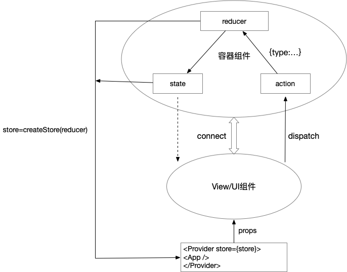
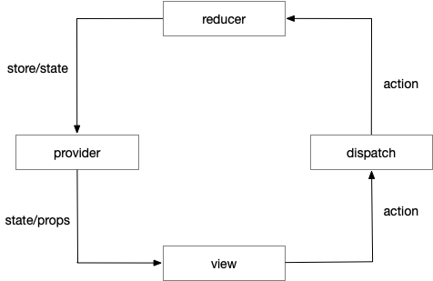
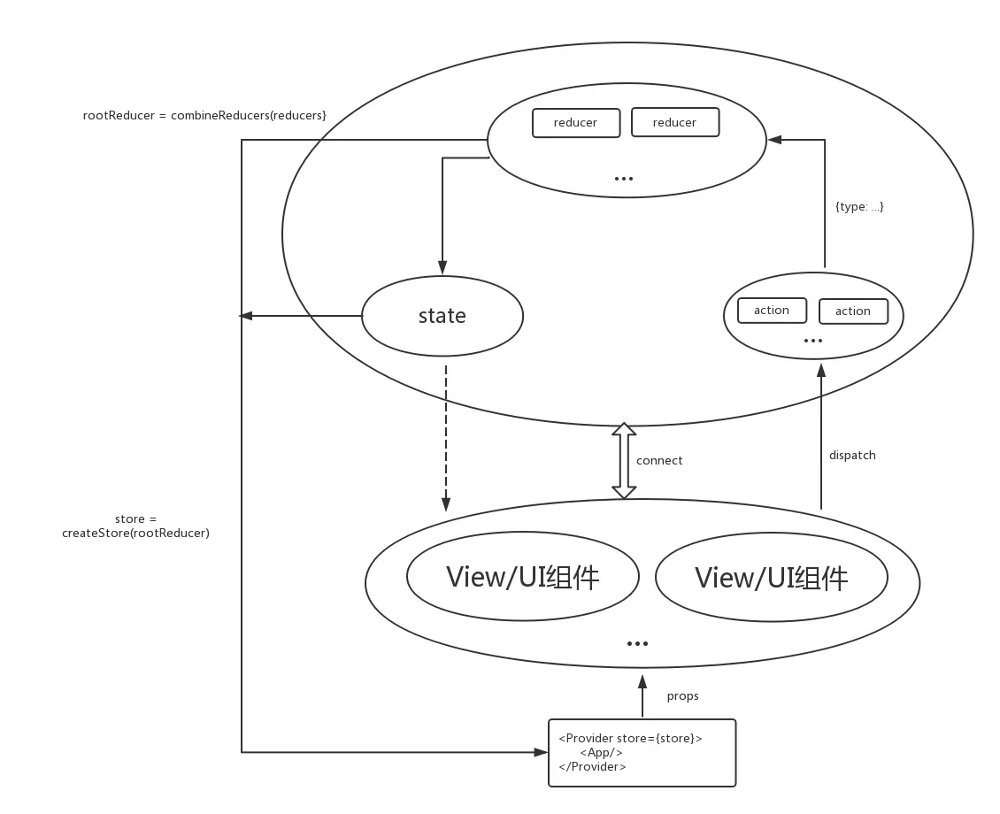

# 第四节 redux的原理剖析

## 数据流向

* 路由分发root.js

```js

// 创建一个store全局管理state和操作
const store = createStore(reducer);

// Provider在根组件<App>外面包了一层，App的所有子组件就默认都可以拿到store，通过组件的props传递
export default class Root extends Component {
    render() {
        return (
            <Provider store={store}>
              <App />
            </Provider>
        )
    }
}

```

* 入口文件app.js

```js

// view提供UI组件
class Counter extends Component {
    render() {
        // View的状态来自于props，props传递的是store中的state
        const { value, onIncreaseClick } = this.props;
        return (
            <div>
              <span>{value}</span>
              <button onClick={onIncreaseClick}>Increase</button>
            </div>
        )
    }
}

// 将UI组件和容器组件连接起来
const App = connect(
    state = ({
        value: state.count // 输入，将store中的state通过props输入
    }),
    dispatch => ({ // 输出，将action作为props绑定到View上，用户操作类型在此分发出去
        onIncreaseClick: () => dispatch(increaseAction.increase())
    })
)(Counter)
export default App;
```

* 定义action的类型

```js
export const INCREMENT = 'INCREMENT';

// action创建函数只是简单的返回一个action
export function increase(params) {
    return {
        type: INCREMENT,
        data: data
    };
}
```

* reducer: counterReducer.js

```js
// 提供一个初始的状态
initState = {
    count: 0
};

// 通过判断Action的类型，返回新的数据改变后的state对象，即使没有任何状态的改变，也要返回一个对象
export default function counter(state = initState, action) {
    const count = state.count;
    switch (action.type) {
        case INCREMENT:
          return { count: count + 1}
          break;
        default: 
          return state;
    }
}
```

数据的流向可以看下图，


1. 在图中，View组件只提供UI，没有自己的state和操作，是什么导致界面的变化？

是view本身的props，因为组件的初始状态由props决定，虽然没有自己的state，假如他的props发生改变，界面也会发生变化。

2. View的props内容由什么提供，多个View中的props如何区分？

由应用中全局唯一store中的state提供，所有的状态，保存在一个对象里面，通过key区分。`<Provider store={store}><App /></Provider>`这行代码实现了为应用绑定唯一的store。

3. store是怎么来的？

通过`store=createStore(reducer)`创建，reducer返回的正好是变化后的state对象。
以上三个问题解释了上图左半部分的数据流向，`reducer-(store/state)-provider-(state/props)-view`

4. action是如何与reducer绑定的，或者说，reducer(state, action)这个函数中的action是怎么来的？

是`store.dispatch(action)`内部处理的，先看下`createStore(reducer)`这个函数，简略代码如下：

```js
function createStore = (reducer) => {
    let currentState; // 内部的状态
    let listeners = []; // 所有的监听者

    const getState = () => currentState; // 获取store中的state

    // dispatch的操作就是内部执行reducer()函数，action和reducer在这儿产生交集，并且通知所有的监听者
    const dispatch = (action) => {
        currentState = reducer(state, action); // 更新state
        listeners.forEach(listener => listener());
    }

    // 订阅事件
    const subscribe = (listener) => {
        listeners.push(listener);
        return () => {
            listeners = listeners.filter(l = > l !== listener)
        }
    }

    return {
        getState,
        dispatch,
        subscribe
    }
}
```

为什么没有显示的写出调用的是store中，这个是React-Redux中connect和Provider的功劳，如果不用他们，上面app.js中的代码应该如下：

```js
class Counter extends Component {
    componentWillMount() {
        // 订阅状态变化
        store.subscribe((state) => this.setState(state))
    }
    render() {
        return {
            <div>
              <span>{value}</span>
              // 点击后dispatch事件类型
              <button onClick={()=>store.dispatch(increaseAction.increase())}>Increase</button>
            </div>
        }
    }
}
```

5. reducer()函数执行之后，是如何更改state的？

见问题4中createStore的代码，简化的可以写成：

```js
function createStore = (reducer) => {
    let currentState; // 内部的状态
    const getState = () => currentState; // 获取store中的state

    // 更新state
    const dispatch = (action) => {
        currentState = reducer(state, action);
    }

    return {
        getState,
        dispatch,
    }
}
```

以上两个问题解决了上图右半部分的数据流向，`view-(action)-dispatch-(action)-reducer`，两个数据循环合在一起，就是一个圆，完成了生命的大和谐，如下图：



## 多个Reducer

看完上面的分析，在进一步拓展下，上图中只有一个reducer，正常的app中有很多view，自然有很多相对应的reducer，那么一个界面的action是如何与其对应的reducer绑定的呢？

假如上面的项目中添加了一个loginReducer.js文件，代码如下：

```js
// 提供一个初始的状态
initState = {
    login: false,
}

// 通过判断Action的类型，返回新的数据改变后的state对象，即使没有任何状态的改变，也要返回一个对象
export default function login(state=initState, action) {
    const login = state.login;
    switch (action.type) {
        case INCREMENT:
          return { login: !login }
        default:
          return state
    }
}
```

这个reducer就执行一个操作，收到INCREMENT这个操作类型，登录状态反转一次。假如再点击那个按钮，count这个数字增加的同时，登录状态会不会发生变化呢？答案是会的！

会的前提是：你用到了下面的代码：

```js
const rootReducer = combineReducers({
    counter: counter,
    login: login
});
store=createStore(rootReducer);
```

combineReducers顾名思义就是合并reducer，所谓的合并，就是把reducer函数对象整合为单一reducer函数，它会遍历所有的子reducer成员，并把结果整合进单一状态树，所以最后只有一个reducer，重复一遍，最后只有一个reducer函数！combineReducers粗略的代码如下：

```js
export default function combineReducers(reducers) {
    var reducerKeys = Object.keys(reducers);
    var finalReducers = {}

    // 提取reducers中value值为function的部分
    for (var i = 0; i < reducerKeys.length; i++) {
        var key = reducerKeys[i];
        if (typeof reducers[key] === 'function') {
            finalReducers[key] = reducers[key];
        }
    }

    var finalReducerKeys = Object.keys(finalReducers);
    return function combination(state = {}, action ={}) {
        var hasChanged = false;
        var nextState = {};
        /**
         * 遍历访问finalReducers
         */
        for (var i = 0; i < finalReducerKeys.length; i++) {
            var key = finalReducerKeys[i];
            var reducer = finalReducers[key];
            /**
             * 将state按照reducer的名字分离
             * 每个key都对应着state
             */
            var previousStateForKey = state[key];
            var nextStateForKey = reducer(previousStateForKey, action);

            nextState[key] = nextStateForKey;
            hasChanged = hasChanged || nextStateForKey !== previousStateForKey
        }
        return hasChanged ? nextState : state
    }
}
```

上面的代码可以看出，当dispatch一个action，所有的reducer函数都会执行一遍，通过action.type修改对应的state，从而所有订阅相应state的View都会发生变化。所以上面问题的答案就是：会。
最后再放一个图，也就是多个reducer和action时的数据流向图。



图上可以看出，store，state，reducer，action其实最后都只有一个，我们只是为了代码逻辑将其分为多个，层次分明，便于开发和阅读。

## 总结

一句话总结，View负责UI界面，redux将View中的state和操作集中起来在store中管理，然后通过props将修改后的state内容传递给View，界面发生变化。用户操作界面，View通过dispatch执行相关操作，然后将ActionType和Data交由reducer函数，根据ActionType和Data修改state。

